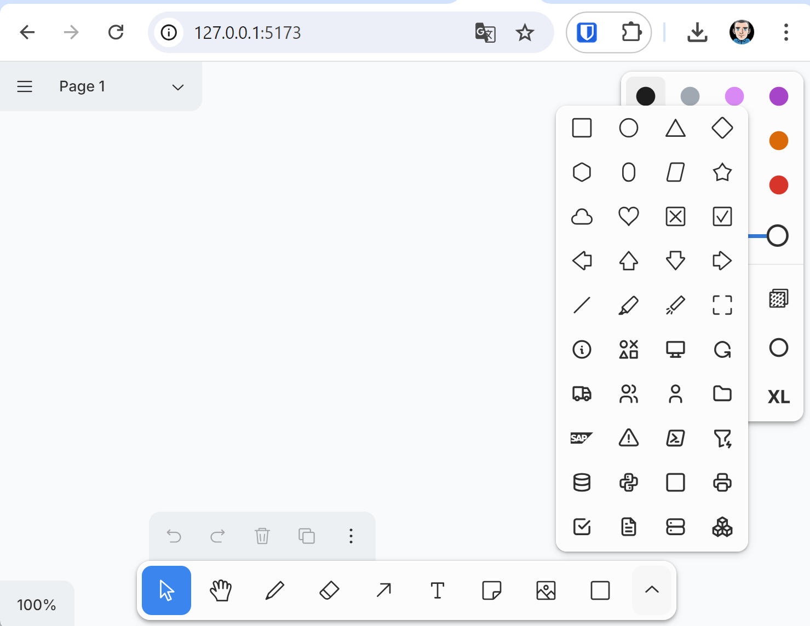

# Tldraw with Icons

Add icons tools in tldraw

## Usage

> git clone https://github.com/fraoustin/tldrawicons.git

> cd tldrawicons

> docker build -t tldrawicons .

> docker run --rm --name tldrawicons -p 5173:5173 tldrawicons

you connect on http://localhost:5173/

If you want to add your own icon: add icon (format svg, size square) in icons directory and re-build your image